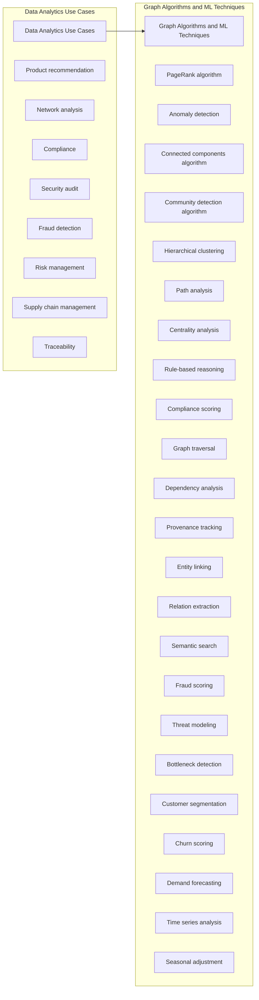

```mermaid
graph LR;
  subgraph Data Analytics Use Cases
    A[Customer 360 analysis]
    B[Product recommendation]
    C[Network analysis]
    D[Compliance]
    E[Security audit]
    F[Fraud detection]
    G[Risk management]
    H[Supply chain management]
    I[Traceability];
  end
  subgraph Graph Algorithms and ML Techniques
    J[Shortest path algorithm]
    K[PageRank algorithm]
    L[Anomaly detection]
    M[Connected components algorithm]
    N[Community detection algorithm]
    O[Hierarchical clustering]
    P[Path analysis]
    Q[Centrality analysis]
    R[Rule-based reasoning]
    S[Compliance scoring]
    T[Graph traversal]
    U[Dependency analysis]
    V[Provenance tracking]
    W[Entity linking]
    X[Relation extraction]
    Y[Semantic search]
    Z[Fraud scoring]
    AA[Threat modeling]
    BB[Bottleneck detection]
    CC[Customer segmentation]
    DD[Churn scoring]
    EE[Demand forecasting]
    FF[Time series analysis]
    GG[Seasonal adjustment];
  end
  A[Data Analytics Use Cases] --> J[Graph Algorithms and ML Techniques];
  

  
```
