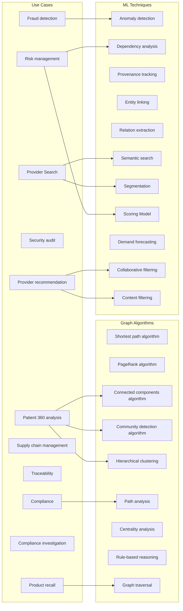

```mermaid


graph LR;
  subgraph G1["Use Cases"]
    A[Patient 360 analysis]
    B[Provider recommendation]
    C[Compliance]
    E[Security audit]
    F[Fraud detection]
    R1[Risk management]
    H[Supply chain management]
    I[Traceability]
    PR[Product recall]
    U2[Compliance investigation]
    PS[Provider Search];

  end
  subgraph G2["Graph Algorithms"]
    J[Shortest path algorithm]
    K[PageRank algorithm]
    M[Connected components algorithm]
    N[Community detection algorithm]
    O[Hierarchical clustering]
    PA[Path analysis]
    Q[Centrality analysis]
    R[Rule-based reasoning]
    GT[Graph traversal]
  end

  subgraph G3["ML Techniques"]
    L[Anomaly detection]
    DA[Dependency analysis]
    V[Provenance tracking]
    W[Entity linking]
    X[Relation extraction]
    SS[Semantic search]
    SEG[Segmentation]
    SM[Scoring Model]
    EE[Demand forecasting]
    HH[Collaborative filtering]
    JJ[Content filtering]
  end

  A --> M;
  A --> N;
  A --> O;
  F --> L;
  B --> HH;
  B --> JJ;
  PR --> GT;
  R1 --> DA;
  PS --> SS;
  PS --> SEG;
  C --> PA;
  R1 --> SM;
```
